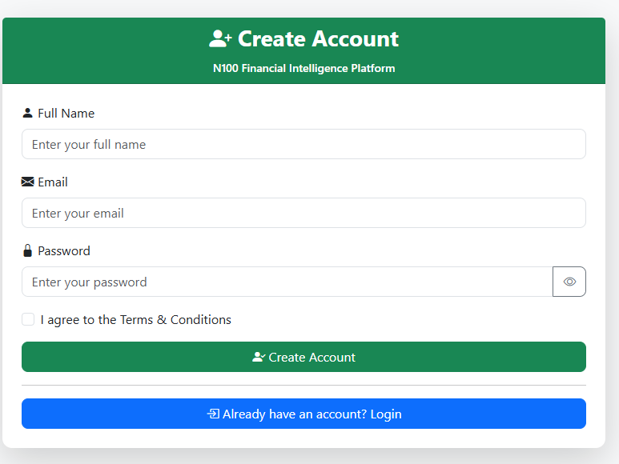
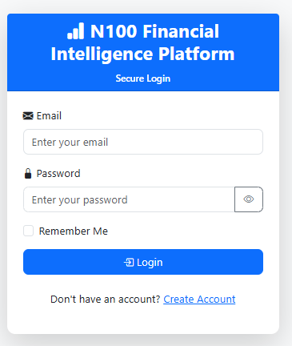
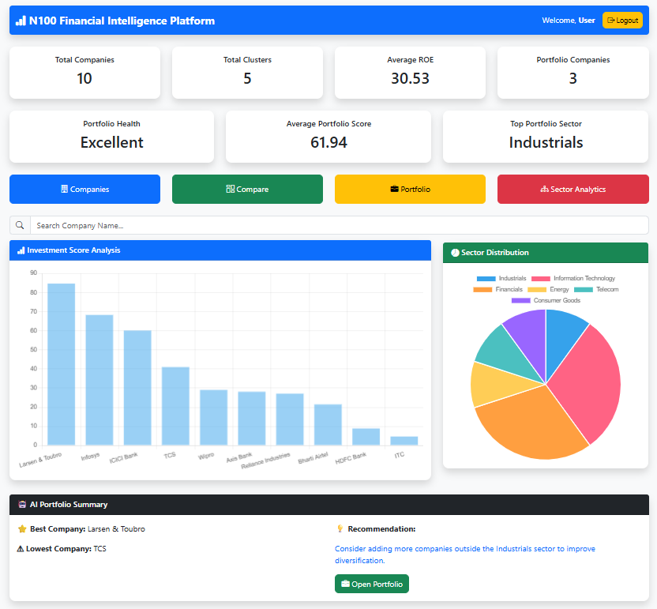
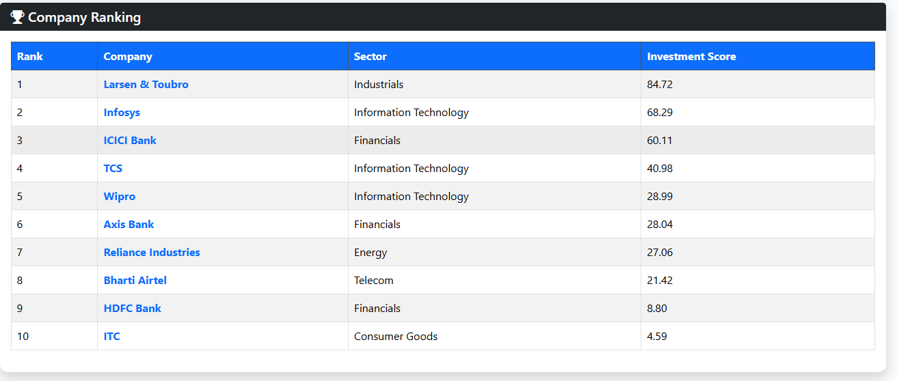
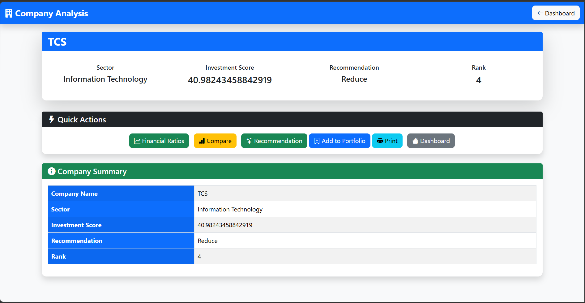
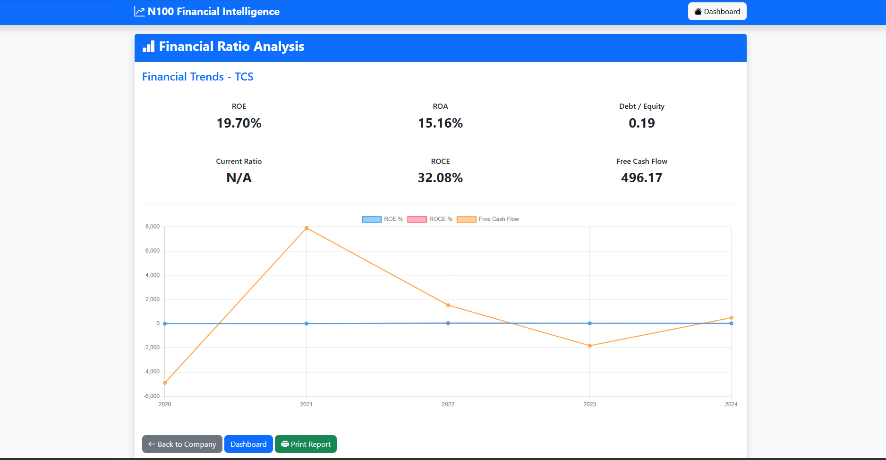
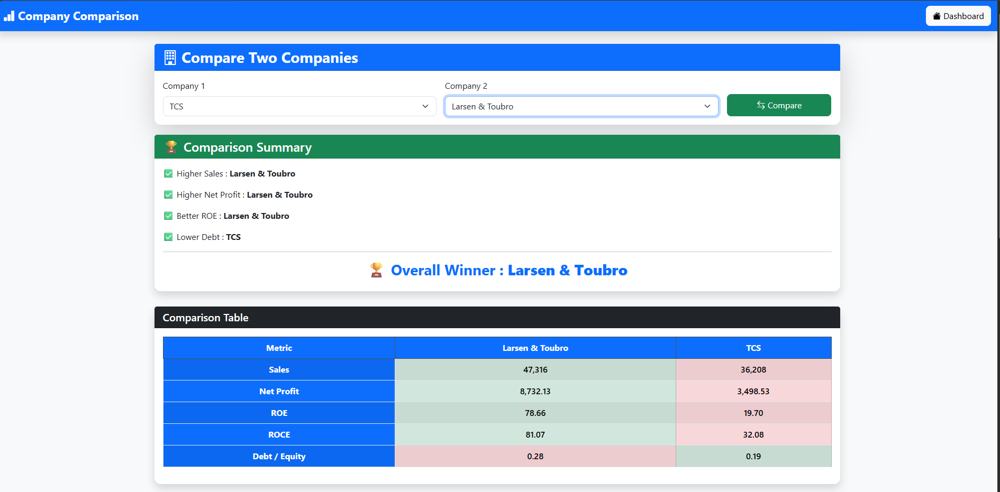
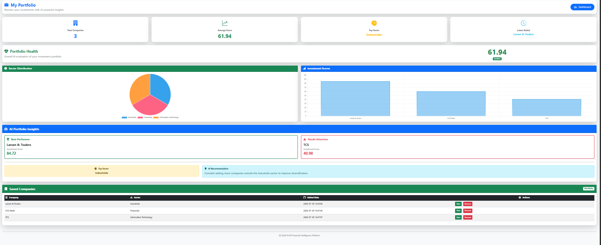
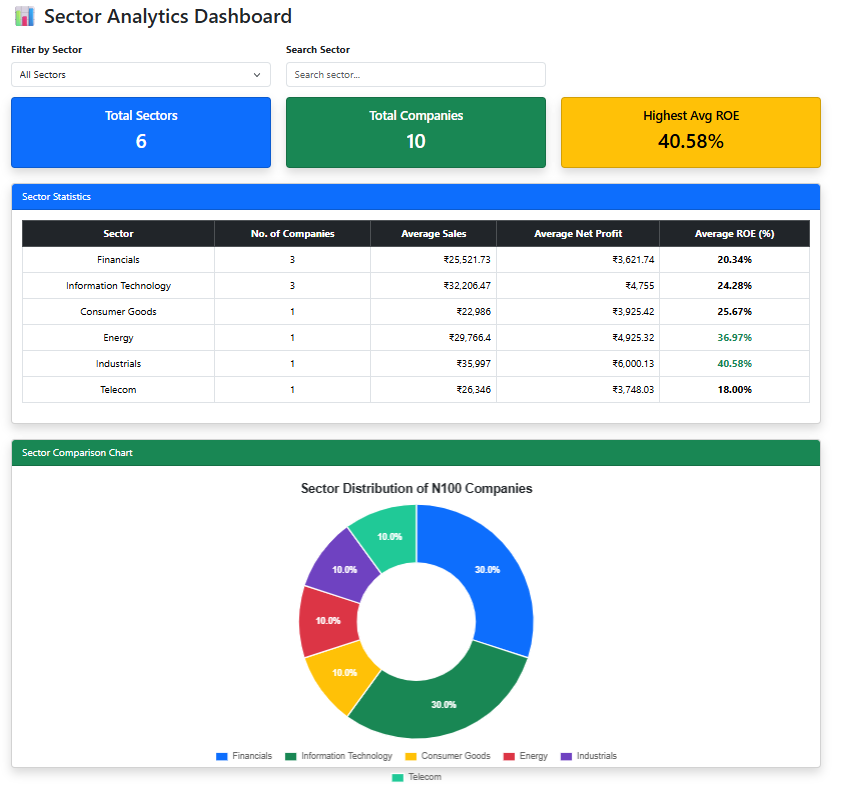
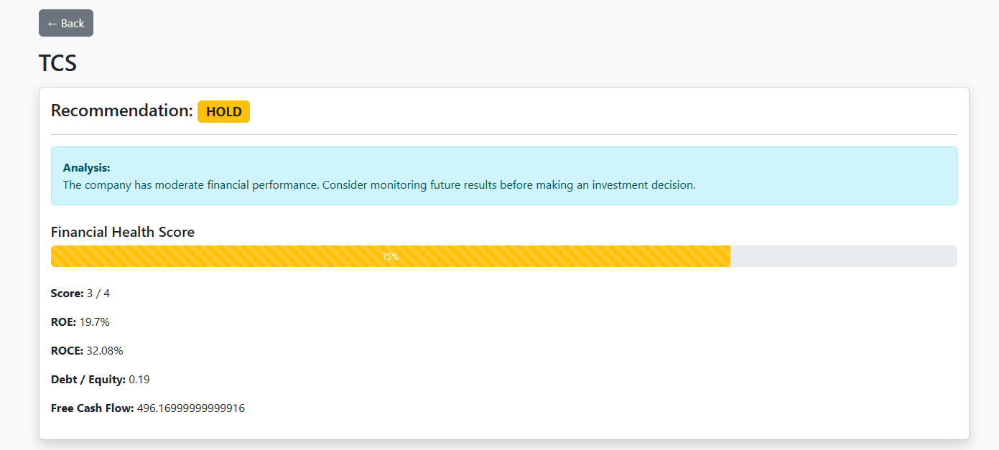

# 📈 N10 Financial Intelligence Platform

An AI-powered financial analytics platform built using **FastAPI**, **SQLite**, **HTML**, **Bootstrap**, and **JavaScript** for analyzing Nifty 10 companies. The platform provides company analysis, financial ratios, sector analytics, portfolio management, AI-driven insights, and company comparison dashboards.

## About the Project

This project was developed during my **Data Analyst Internship at Bluestock Fintech**.where I designed and developed a financial intelligence platform featuring analytics dashboards, investment scoring, portfolio management, and sector-wise financial analysis.


--- ## 🌐 Live Demo

**Project URL:**  
https://nifty-financial-platform-dashboard.onrender.com


## 🚀 Features

### 🔐 User Authentication
- User Registration
- User Login
- JWT Authentication
- Protected API Endpoints

### 📊 Dashboard
- Total Companies
- Total Sectors
- Top Performing Companies
- Investment Score Overview
- Interactive Charts

### 🏢 Company Analysis
- Company Information
- Market Capitalization
- Industry & Sector Details
- Investment Score
- Recommendation
- Company Rank

### 📉 Financial Ratios
- Return on Equity (ROE)
- Return on Assets (ROA)
- Return on Capital Employed (ROCE)
- Debt-to-Equity Ratio
- Free Cash Flow

### 📊 Sector Analytics
- Sector-wise Performance
- Average Investment Score
- Average ROE
- Average ROCE
- Company Count
- Sector Comparison Charts

### ⚖️ Company Comparison
Compare two companies using:

- Sales
- Net Profit
- Free Cash Flow
- ROE
- ROCE
- Debt-to-Equity

Includes:
- Financial Performance Comparison Chart
- Financial Ratio Comparison Chart

### 💼 Portfolio Management
- Add Companies
- Remove Companies
- Portfolio Summary
- Portfolio Health Analysis
- Portfolio Performance Charts

### 🤖 AI Portfolio Insights
- Portfolio Health Score
- Investment Suggestions
- Risk Analysis
- Portfolio Recommendations

### ⭐ Recommendation Engine
- Buy Recommendations
- Hold Recommendations
- Investment Scores
- Company Rankings

---

# 🛠️ Tech Stack

## Frontend
- HTML5
- CSS3
- Bootstrap 5
- JavaScript
- Chart.js

## Backend
- FastAPI
- Python

## Database
- SQLite

## Data Processing
- Pandas
- NumPy

---

# 📁 Project Structure

```
nifty100-data-foundation/
│
├── frontend/
│   ├── css/
│   ├── js/
│   ├── images/
│   ├── login.html
│   ├── dashboard.html
│   ├── companies.html
│   ├── company.html
│   ├── compare.html
│   ├── portfolio.html
│   ├── recommendation.html
│   └── sector.html
│
├── output/
│   └── company_scores.csv
│
├── src/
│   ├── api/
│   ├── auth/
│   ├── database/
│   ├── models/
│   └── services/
│
├── tests/
├── requirements.txt
├── README.md
└── .gitignore
```

---

# ⚙️ Installation

## Clone Repository

```bash
git clone https://github.com/Rajkumar200526/nifty100-data-foundation.git

## Navigate to Project

```bash
cd nifty100-data-foundation
```

---

## Create Virtual Environment

Windows

```bash
python -m venv .venv
```

Activate

```bash
.venv\Scripts\activate
```

---

## Install Dependencies

```bash
pip install -r requirements.txt
```

---

## Start Backend

```bash
uvicorn src.api.main:app --reload
```

Backend URL

```
http://127.0.0.1:8000
```

Swagger API

```
http://127.0.0.1:8000/docs
```

---

## Start Frontend

Open the frontend using **Live Server** in VS Code.

Example:

```
http://127.0.0.1:5500/frontend/login.html
```

---

# 📊 APIs

- Authentication
- Dashboard
- Companies
- Company Details
- Financial Ratios
- Compare Companies
- Sector Analytics
- Recommendation
- Portfolio
- Portfolio Health
- Portfolio Insights

---

# 📷 Screenshots
---
## Create Account



---

## Login Page



---

## Dashboard



---
##  Companies



---

## Company Analysis



---

## Financial Ratios



---

## Compare Companies



---

## Portfolio



---

## Sector Analytics



---

## Recommendation



---

# 🎯 Future Enhancements

- Live Stock Market Data
- Real-Time Price Tracking
- AI Chat Assistant
- News Sentiment Analysis
- Stock Price Prediction
- Watchlist
- Email Alerts
- Cloud Deployment
- Mobile Application

---

# 👨‍💻 Developed By

**AMPOLU RAJ KUMAR**

B.Tech Computer Science Engineering (Artificial Intelligence & Machine Learning)
Seshadri Rao Gudlavalleru Engineering College

---

# 📜 License

This project is developed for educational and academic purposes.

---

# ⭐ Acknowledgements

- FastAPI
- Bootstrap
- Chart.js
- SQLite
- Pandas
- NumPy
- Nifty 100 Dataset

---

## ⭐ If you like this project, don't forget to Star the repository!